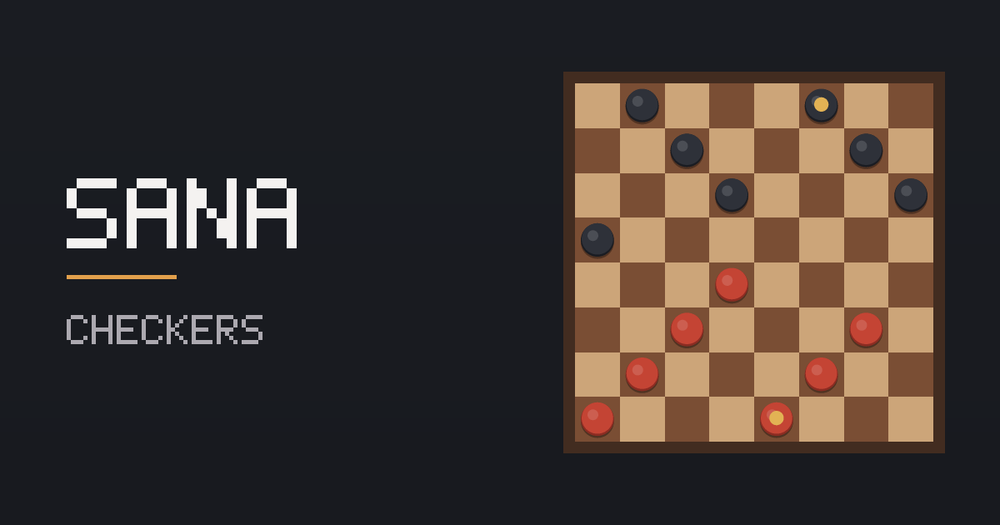

# Sana

A checkers game for Sana. Play at https://naukhangreenwin.github.io/sana-checkers/.

Zero-dependency English draughts (American checkers) that runs entirely in the browser.



## Features

- **Two-player local** — pass-and-play on one device.
- **Three computer opponents** — Easy (random legal move), Medium (3-ply minimax with alpha-beta pruning), Hard (5-ply minimax with alpha-beta, piece-square tables, king weighting and a quiescence search so it never stops mid-exchange).
- **Full rules** — mandatory captures, multi-jump chains, crowning, win by capture or by blockade, draw by 40 quiet king moves.
- **Move history** in standard draughts notation (`11-15`, `22x18`, `27x18x11x2`).
- **Undo**, light/dark themes, optional sound, toggleable move hints and square numbers.
- **Keyboard accessible** — arrow keys move the cursor, Enter/Space selects and moves, Escape deselects, `U` undoes, `N` starts a new game.
- **Responsive** from 320 px phones to 4K, with a collapsible history drawer on mobile.
- No build step, no frameworks, no CDN scripts, no external assets.

## Rules recap

English draughts is played on the 32 dark squares of an 8×8 board, numbered 1–32. Each side starts with 12 men; **Black moves first**.

1. **Movement** — men move one square diagonally *forward* to an empty square.
2. **Capturing** — jump diagonally over an adjacent opposing piece to the empty square directly beyond it; the jumped piece is removed.
3. **Captures are mandatory.** If any capture is available you must take one. If a jump can be continued from the landing square, the chain must continue as part of the same move.
4. **Crowning** — a man reaching the far back row becomes a King. Crowning **ends the move**, even if another jump looks available.
5. **Kings** move and capture diagonally in *both* directions.
6. **Winning** — capture all opposing pieces, or leave the opponent with no legal move.
7. **Draw** — 40 consecutive king moves with no capture and no crowning.

## Controls

| Action | Mouse / touch | Keyboard |
|---|---|---|
| Select a piece | Tap / click it | Arrow keys, then Enter or Space |
| Move | Tap / click a highlighted square | Arrow keys, then Enter or Space |
| Deselect | Tap the piece again | Escape |
| Undo | Undo button | `U` |
| New game | New game button | `N` |

Amber rings mark capture landings; small dots mark quiet moves. During a multi-jump the whole chain resolves as a single move and is written as one notation entry.

## Project layout

```
index.html              markup, meta and Open Graph tags
css/style.css           design tokens, board, pieces, responsive layout
js/rules.js             pure rules engine (move generation, legality, status)
js/ai.js                evaluation + negamax with alpha-beta pruning
js/sound.js             Web Audio effects, generated at runtime
js/main.js              UI controller, animation and interaction
assets/                 favicon, apple-touch-icon, Open Graph image
test/engine.test.mjs    78 headless rules/AI assertions
test/browser.test.mjs   CDP browser suite: real UI play, a11y, responsive
```

`js/rules.js` and `js/ai.js` are DOM-free, so both run unchanged under Node.

## Running locally

```bash
python3 -m http.server 8777
# open http://127.0.0.1:8777/
```

ES modules require a server; opening `index.html` from `file://` will not work.

## Tests

```bash
node test/engine.test.mjs   # rules + AI, no browser needed
```

Covers geometry, directionality, forced captures, multi-jump chains (including a verified triple jump `27x18x11x2`), crowning — including the rule that crowning terminates a jump chain — blockade and capture wins, the 40-move draw, state immutability, and six full AI-vs-AI games audited move by move for illegal moves, bad crownings and material accounting errors.

The browser suite drives a headless Chrome over the DevTools Protocol, plays 30 real moves through the DOM, and checks console cleanliness, undo, theming, keyboard navigation, touch-target sizes and layout at 320/390/820/1440/2560 px.

## Licence

MIT.
